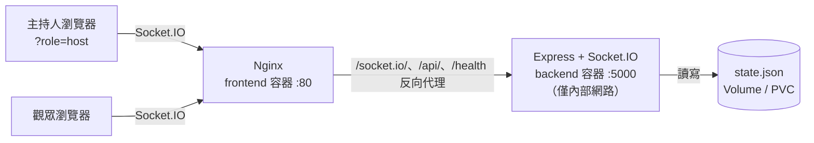

# Raffle Drum 抽籤系統

即時多人同步的抽籤(滾筒式)Web 應用。主持人設定名單並啟動抽獎,所有觀眾的畫面透過 WebSocket 同步播放滾動動畫並同時揭曉中獎名單。

## 功能特色

- **雙角色模式**:主持人(Host)可輸入名單、調整設定、啟動抽獎;觀眾(Viewer)只能觀看
- **即時同步**:所有連線畫面(不限裝置數)透過 Socket.IO 同步動畫與結果
- **標籤式名單輸入**:輸入名稱後按 Enter 或逗號即成為標籤,可單獨刪除、自動去重
- **彈性抽獎設定**:單次抽取人數、動畫秒數、單輪不重複、得獎者是否留在池中
- **狀態持久化**:名單、設定與中獎紀錄存於 `state.json`,重啟不遺失

## 專案架構

```
Raffle-Drum/
├── src/
│   ├── backend/          # Express + Socket.IO 伺服器(TypeScript)
│   │   ├── src/          #   server.ts(事件處理)、draw.ts(抽獎邏輯)、state.ts(持久化)
│   │   └── test/         #   Vitest 測試
│   └── frontend/         # React 18 + MUI + Vite(TypeScript)
│       └── src/          #   components/(UI 元件)、hooks/(Socket 狀態同步)、lib/(驗證邏輯)
├── docs/                 # 專案文件
│   ├── spec.md           # 專案規格書
│   └── acceptance.md     # 驗收條件
├── deploy/               # 部署與容器化設定
│   ├── docker/
│   │   ├── docker-compose.yml
│   │   ├── Dockerfile.backend
│   │   ├── Dockerfile.frontend
│   │   └── nginx/        # 前端容器的 nginx 設定(靜態檔 + /socket.io/ 反向代理)
│   └── k8s/              # Kubernetes 部署 YAML(raffle-system namespace)
```

### 系統架構



前端容器由 nginx 同時負責:靜態檔案服務(React build 產物)與 `/socket.io/`(WebSocket)、`/api/`、`/health` 的反向代理(後端位址由環境變數 `BACKEND_HOST` 注入)。後端 5000 port 不對外映射,只在容器內部網路供 nginx 存取;瀏覽器只需連得到前端的 port。

## 使用方法

| 角色 | 網址 | 權限 |
|------|------|------|
| 主持人 Host | `http://<host>:3000/?role=host` | 輸入名單、設定、START DRAW / RESET |
| 觀眾 Viewer | `http://<host>:3000/` | 只看滾動螢幕與中獎紀錄 |

主持人操作流程:

1. **輸入名單**:在項目輸入框輸入名稱後按 **Enter 或逗號**即新增為標籤;可貼上逗號分隔的整串名單一次匯入;點標籤的 ✕ 刪除;重複名稱自動忽略
2. **調整設定**:
   - 單次抽取人數 — 一輪抽出幾個中獎者
   - 動畫秒數 — 滾動動畫時長(0.5–60 秒)
   - 重複限制(不重複)— 同一輪抽出的名字不重複
   - 允許得獎者留在池中 — 開啟後已中獎者在後續輪次仍可中獎;關閉則自動排除
3. **START DRAW** — 所有畫面同步滾動,結束後彈出中獎名單並記入紀錄
4. **RESET** — 清空名單、紀錄與設定,回到初始狀態

防呆:候選池為空、人數不足、抽獎進行中、連線中斷時,START DRAW 自動停用並顯示原因。

## 快速開始(Docker Compose)

專案已將 `docker-compose.yml` 中的 build context 設定為 `../..`（即專案根目錄）。因此，您不論是在**專案根目錄**下，或是切換至 **`deploy/docker/` 目錄**下，皆能順利執行 Docker Compose。

**1. 在專案根目錄下執行：**

```bash
# 啟動服務
docker compose -f deploy/docker/docker-compose.yml up -d --build

# 停止服務
docker compose -f deploy/docker/docker-compose.yml down
```

**2. 在 `deploy/docker/` 目錄下執行：**

```bash
# 切換目錄並啟動服務
cd deploy/docker
docker compose up -d --build

# 停止服務
docker compose down
```

- 前端：<http://localhost:3000> (主持人請加 `?role=host`)
- 後端 API(經 nginx 代理)：<http://localhost:3000/health>、<http://localhost:3000/api/state>
- 後端 5000 port **不對主機開放**,僅供 frontend 容器內部存取
- 抽獎資料保存在 repo 根目錄的 `./backend-data/state.json`

## Image 建置說明

不論是透過 Docker Compose 還是手動建置，兩個 image 都必須以 **repo 根目錄為 build context** (Dockerfile 在 `deploy/docker/` 內)：

```bash
# 後端:multi-stage — 先以 npm workspace 編譯 TypeScript,再組出只含 production 依賴的執行 image
docker build -f deploy/docker/Dockerfile.backend -t raffle-backend:0.1.1 .

# 前端:multi-stage — Vite build 靜態檔,放進 nginx:alpine,啟動時以 envsubst 注入 BACKEND_HOST
docker build -f deploy/docker/Dockerfile.frontend -t raffle-frontend:0.1.1 .
```

| Image | Base | Port | 主要環境變數 |
|-------|------|------|--------------|
| raffle-backend | node:20-alpine | 5000(僅容器內部,不對主機映射) | `PORT`、`DATA_DIR`(state.json 存放目錄) |
| raffle-frontend | nginx:1.27-alpine | 80(對外映射 3000) | `BACKEND_HOST`(後端主機名,供 nginx 代理) |

## Kubernetes 部署

`deploy/k8s/` 內含完整 YAML,部署到 `raffle-system` namespace:

```bash
kubectl apply -f deploy/k8s/
```

| 檔案 | 內容 |
|------|------|
| `deploy/k8s/namespace.yaml` | `raffle-system` namespace |
| `deploy/k8s/backend-deployment.yaml` | 後端 Deployment(**單副本 + Recreate**,見下註)含 liveness/readiness probe |
| `deploy/k8s/backend-pvc.yaml` | 256Mi PVC,掛載於 `/app/data` 保存 state.json |
| `deploy/k8s/backend-service.yaml` | ClusterIP `raffle-backend-service`:5000 |
| `deploy/k8s/frontend-deployment.yaml` | 前端 Deployment,`BACKEND_HOST=raffle-backend-service` |
| `deploy/k8s/frontend-service.yaml` | NodePort 對外服務 |

> **註**:後端必須維持單副本 — state.json 為單一寫入者的本機檔案,且 Socket.IO 未配置共享 adapter,多副本間無法同步抽獎狀態與廣播。

image 需先載入叢集可見的 registry(或本機叢集如 minikube/kind 直接 load),tag 對應 YAML 中的 `raffle-backend:0.1.1` / `raffle-frontend:0.1.1`。

## 本機開發

```bash
npm install        # 安裝全部 workspace 依賴
npm run dev        # 同時啟動後端(:5000)與前端 Vite dev server
npm test           # 後端 Vitest 測試
npm run build      # 編譯後端 TypeScript + 前端 Vite build
```
