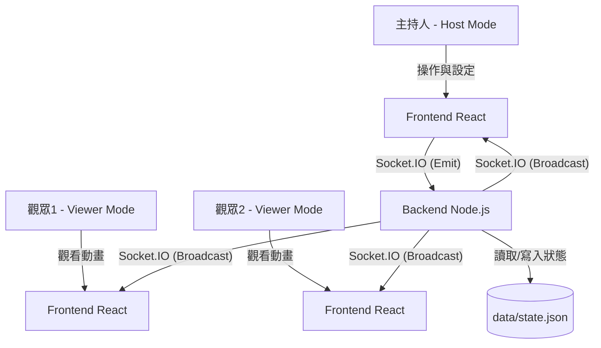

# Raffle Drum 抽籤系統專案規格書 (spec.md)

本文件定義「Raffle Drum 抽籤系統」的專案規格，本系統採用前後端分離架構，支援多人即時連線同步觀看及抽籤狀態持久化保留。

---

## 1. 系統架構與技術棧 (Architecture & Technology Stack)

### 整體架構
本系統分為兩個服務，透過 WebSockets (Socket.IO) 進行實時狀態同步：
*   **Frontend (前端服務)**：React + MUI + TypeScript，作為 UI 展示與操作端。
*   **Backend (後端服務)**：Node.js + Express + Socket.IO，負責集中管理抽籤池、過濾邏輯、執行隨機抽籤演算法，並將結果即時同步廣播給所有連線前端。
*   **State Persistence (持久化)**：後端將抽籤狀態及歷史結果定期寫入本地 JSON 檔案 (`/app/data/state.json`)，透過 Volume 掛載保留狀態。



### 技術棧定義
*   **前端 (Frontend)**：React 18+, TypeScript, Vite, MUI v5/v6, Socket.IO Client, canvas-confetti.
*   **後端 (Backend)**：Node.js, Express, Socket.IO (WebSockets), TypeScript (或 JavaScript).
*   **測試 (Testing)**：
    *   前端/後端：使用 Vitest 進行單元測試與 API 測試。
*   **容器化與編排 (Containerization)**：
    *   **Dockerfile.frontend**：多階段建置，使用 Nginx 託管 React 靜態檔案。
    *   **Dockerfile.backend**：Node 運行環境，暴露 WebSocket 埠口 (預設 5000)，並為 `/app/data` 宣告 Volume 空間。
    *   **Docker Compose**：管理 `frontend` 與 `backend` 雙容器，掛載本地目錄做狀態持久化。
    *   **Kubernetes**：
        *   `raffle-backend-deployment` (掛載 PVC / HostPath 用於儲存 state.json)。
        *   `raffle-frontend-deployment` (靜態 Nginx 網頁)。
        *   對應的 ClusterIP 與 NodePort Service。

---

## 2. 業務邏輯與同步規格

### 狀態管理 (Backend State Schema)
後端 `state.json` 結構需包含：
```json
{
  "items": ["Tom", "Jerry", "Spike", "Tyke"],
  "settings": {
    "allowRepeat": false,
    "unique": true,
    "drawCount": 1,
    "animationDuration": 3
  },
  "history": [
    {
      "round": 1,
      "timestamp": "2026-07-14T12:00:00Z",
      "winners": ["Jerry"]
    }
  ],
  "currentStatus": {
    "isDrawing": false,
    "startTime": null,
    "candidates": []
  }
}
```

### 即時同步與防呆邏輯
1.  **連線初始同步**：任何客戶端連線時，後端會主動推播 `full-state`，將最新的 `items`、`settings`、`history` 與 `currentStatus` 給前端，前端依據此狀態繪製畫面。
2.  **角色劃分**：
    *   **Host (主持人)**：開啟網頁時可帶入密碼或 URL 參數（如 `?role=host`）。只有 Host 的 UI 會顯示「項目輸入框」、「設定區」與「START DRAW / RESET」按鈕。
    *   **Viewer (觀眾)**：預設角色。UI 僅顯示「滾動大螢幕」與「中獎紀錄」，輸入與控制區均隱藏。
3.  **抽籤同步流程**：
    *   Host 點擊 "START DRAW" -> 發送 `draw-request` 給 Server。
    *   Server 驗證防呆條件（例如：剩餘人數是否足夠），通過後在後端隨機選出中獎者。
    *   Server 向所有連線的客戶端廣播 `draw-start` 事件，附帶隨機的候選滾動名單（確保大家滾動的視覺內容一致）與動畫秒數。
    *   所有前端（包括 Host 與 Viewer）同時開始播放文字快速滾動動畫。
    *   動畫倒數結束，所有前端同時彈出 `Winner Dialog` 並噴灑 Confetti。
    *   Server 更新 `state.json`，並廣播 `state-updated` 更新歷史紀錄。

---

## 3. 容器化與 K8S 規格

### Docker Volumes
*   Docker Compose 中，後端掛載：
    ```yaml
    volumes:
      - ./backend-data:/app/data
    ```
*   Kubernetes 中，後端配置 `volumeMounts` 到 `/app/data`，本地測試可使用 `hostPath` 或 `emptyDir` (開發測試用途) 或標準 PVC。

### 網路與代理
*   Frontend Nginx 配置反向代理，將 `/socket.io` 請求轉發至 `backend:5000`，避免跨網域 (CORS) 問題並簡化部署。
*   K8S 中，透過 Service Name `raffle-backend-service` 進行內部通訊。
